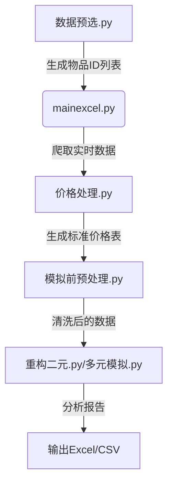
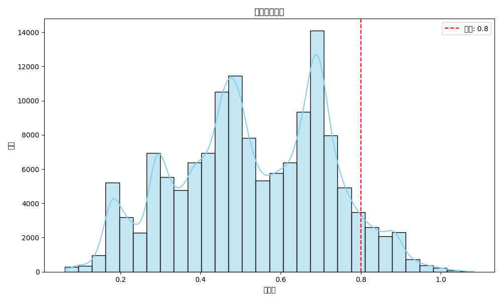
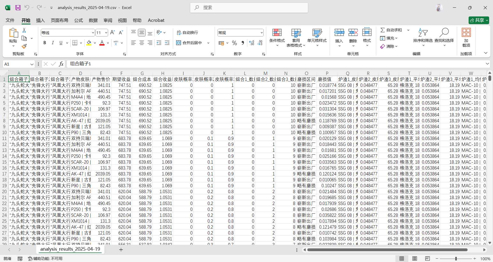

```markdown
# CSGO饰品汰换模拟分析工具 使用文档

## 项目概述
本项目为CSGO饰品汰换组合分析工具，通过多维度数据分析（价格、磨损、品质等），帮助用户计算不同武器箱组合的收益率、成本等关键指标，提供汰换策略建议。包含数据爬取、预处理、多元组合模拟等功能模块。

## 文件结构说明

### 核心模块
| 文件名            | 功能描述                                                                 |
|-------------------|------------------------------------------------------------------------|
| `模拟前预处理.py`    | 数据清洗、品质映射、武器箱ID编码、合并磨损数据                          |
| `数据预选.py`        | 根据品质/磨损筛选Excel数据，生成待爬取的物品编号JSON                     |
| `价格处理.py`        | 合并价格数据与皮肤元数据，生成标准化分析表                              |
| `重构二元.py`        | 二元武器箱组合分析（收益率/成本/概率计算），输出Excel多维报表            |
| `多元模拟.py`        | 多元组合分析（支持N个箱子），多线程加速，磨损预测模型，生成分析报告      |
| `mainexcel.py`      | Buff网站数据爬取核心模块，获取实时价格/磨损/贴纸信息                     |

### 运行控制
| 文件名            | 功能描述                                                                 |
|-------------------|------------------------------------------------------------------------|
| `mian.py`          | 主控脚本，协调各模块执行顺序，参数配置入口                              |

## 数据流程图


## 快速开始

### 环境要求
- Python 3.8+
- 依赖库：`pandas numpy requests tqdm openpyxl xlsxwriter matplotlib seaborn`
- Cookie配置：在`cookie.txt`中填入有效的Buff网站cookie

### 典型工作流
1. **数据初始化**
```bash
python 数据预选.py --input 路径/饰品编号.xlsx --skin_lst ['品质1','品质2','磨损等级',[起始页,结束页]]
```

2. **数据爬取**
```bash
python mainexcel.py --input csgoItemsInfoFixed1.json --output 输出数据.xlsx
```

3. **多元组合分析**（示例：3箱组合）
```bash
python 多元模拟.py --input 数据.xlsx --output 分析结果/ --n 3 --threshold 0.8
```

## 核心功能详解

### 预处理模块
- 品质优先级映射：违禁(1) > 隐秘(2) > ... > 消费级(7)
- 武器箱ID编码：自动生成唯一标识
- 数据合并策略：
  - 高品质皮肤：保留最低价条目
  - 低品质皮肤：按武器箱分组去重

### 多元模拟引擎
- 磨损计算模型：
  ```python
  wear = (max_wear - min_wear) * 权重平均值 + min_wear
  ```
- 多线程加速：支持10线程并行处理
- 智能过滤：收益率阈值(threshold)动态过滤低效组合

### 输出报表
| 工作表名称      | 内容描述                          |
|---------------|-----------------------------------|
| 收益率        | 不同比例组合的预期收益率矩阵       |
| 成本          | 各组合方案的成本对比表            |
| 磨损预测      | 基于线性模型的磨损值预测           |
| 炉渣信息      | 副产品皮肤的均价/磨损统计          |

## 高级配置
```python
# mian.py 关键参数
skin_lst = ['保密', '受限', "崭新出厂", [0,42]]  # 品质1,品质2,目标磨损,武器箱范围
n = 3               # 组合箱子数量
threshold = 0.8     # 收益率过滤阈值
```

## 典型输出示例



## 注意事项
1. 定期更新cookie以保证爬虫功能正常
2. 磨损区间数据需维护`饰品磨损区间.xlsx`
3. 首次运行前执行`pip install -r requirements.txt`


```